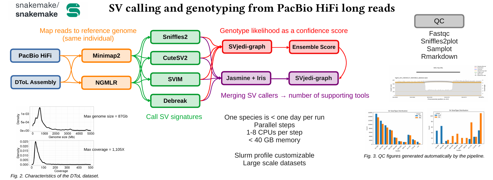
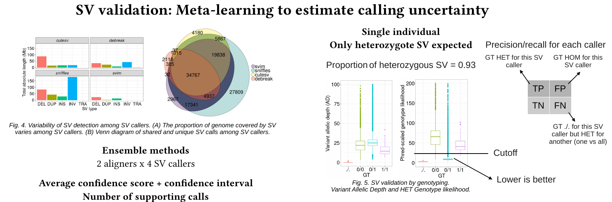

# Snakemake pipeline for the calling and genotyping of genomic Structural Variants based long-read sequencing

**Authors: Thomas Brazier<sup>1</sup>, Lune Angevin<sup>1</sup>, Claire Lemaitre<sup>2</sup> and Claire Mérot<sup>1</sup>**

*Institutions: (1) UMR 6553 ECOBIO, University of Rennes (2) GenScale Team, IRISA-INRIA lab, University of Rennes*

This pipeline performs ensemble calling of Structural Variants (SV) from PacBio HiFi long-read sequencing of a single individual. SV calling is performed by a combination of two aligners (minimap2 + ngmlr) and four different tools: SVIM, Sniffles2, CuteSV2 and Debreak ([poster](images/Poster_PopGroup58_BRAZIER.pdf)). The eight independent callsets are then merged with JasmineSV and SVs are genotyped with SVJediGraph.



The combination of an ensemble of independent callsets and genotype likelihoods allows us to estimate the relative performance of each tool on a given dataset, and to weight these tools in order to get the best calls with a reliable proxy of their uncertainty.




## Installing the pipeline

The following dependencies must be installed before launching the pipeline:
* conda
* snakemake >= 8.9.0
* mamba
* python
* pandas

First you can clone the github repository where you wish to run analyses.

```
git clone https://github.com/thomasbrazier/evolsv.git
cd evolsv
```

And then, you can install dependencies in a `conda` environment.

```
conda env create -f workflow/envs/snakemake.yaml
conda activate snakemake
```


## Using the pipeline

There are three config files to set up your analysis:
* `config/config.yaml`, where you specify the working directory and all the settings for the different tools.
* `config/samples.tsv`, a three columsn data frame to specify the sample name, the SRA accessions and the reference genome accession. Currently, the pipeline accepts multiple samples but only a single genome accession.
* `profiles/slurm/config.yaml`, a profile for the SLURM job scheduler, specifying resources for each rule (number of cpus, memory, runtime).


After setting up the required config files, you can launch the pipeline in two ways: either by running the `launcher.sh` script (where you can configure your settings if you are using a SLURM job scheduler), or simply by executing the following command in the terminal:

```
snakemake --snakefile ./workflow/Snakefile --configfile ./config/config.yaml --profile ./profiles/slurm --use-conda --cores 1
```

Before running the analysis, you can build Conda environments:

```
snakemake --snakefile ./workflow/Snakefile --cores 1 --use-conda --conda-frontend conda --conda-create-envs-only
```

An example dataset with a single sample of the `Vanessa cardui` species can be run with the command:

```
snakemake --snakefile ./workflow/Snakefile --configfile ./config/config_test.yaml --profile ./profiles/slurm --use-conda --cores 1
```

Alternatively, if you wish to run a custom analysis, with config files in a subdirectory:

```
species=Vanessa_cardui

snakemake -s workflow/Snakefile --configfile data/config/config_$species.yaml \
--use-conda --conda-frontend conda --profile ./profiles/slurm --cores 1 \
--config samples="data/config/samples_$species.tsv"
```


## Data directory setup

Project data can be stored in the current `evolsv` git directory. The place where is the `data/` directory must be specified in the parameter `workingdir` in the `config.yaml`. The default is `workingdir: data/` which assumes `data/` to be in te current `evolsv/` directory (see below). `data/` will not be tracked by `git`.

```
.
├── evolsv/
│   ├── config/
│   │   ├── config.yaml
├   |   |── samples.tsv
│   ├── data/
├   ├── profiles/
├   ├   ├── slurm/
│   ├   │   ├── config.yaml
│   ├── workflow/
```


## Output files

The main output file is a VCF file containing the list of SVs, named `{wdir}/{genome}_final.vcf.gz`. It is the result of merging the eigth SV catalogues generated. Additionnally, a `{wdir}/{genome}_final.tsv` and a `{wdir}/{genome}_final_light.vcf.gz` files are produced. They contain the same set of SV calls, but they are designed to be processed more easily than the full vcf. `{wdir}/{genome}_final.tsv` is a data frame without sequences for an easy import in R for data analysis. `{wdir}/{genome}_final_light.vcf.gz` is a lighter vcf without DNA sequences in REF/ALT and INFO fields (DNA sequences can be very large with structural variation).


## References

Chen, Yu, Amy Y. Wang, Courtney A. Barkley, Yixin Zhang, Xinyang Zhao, Min Gao, Mick D. Edmonds, et Zechen Chong. « Deciphering the Exact Breakpoints of Structural Variations Using Long Sequencing Reads with DeBreak ». Nature Communications 14, nᵒ 1 (17 janvier 2023): 283. https://doi.org/10.1038/s41467-023-35996-1.

Danecek, Petr, et al. « Twelve Years of SAMtools and BCFtools ». GigaScience, vol. 10, nᵒ 2, janvier 2021, p. giab008. DOI.org (Crossref), https://doi.org/10.1093/gigascience/giab008.

Heller, David, et Martin Vingron. « SVIM: Structural Variant Identification Using Mapped Long Reads ». Bioinformatics, vol. 35, nᵒ 17, septembre 2019, p. 2907‑15. DOI.org (Crossref), https://doi.org/10.1093/bioinformatics/btz041.

Jiang, Tao, et al. « Long-Read-Based Human Genomic Structural Variation Detection with cuteSV ». Genome Biology, vol. 21, nᵒ 1, décembre 2020, p. 189. DOI.org (Crossref), https://doi.org/10.1186/s13059-020-02107-y.

Kirsche, Melanie, et al. « Jasmine and Iris: Population-Scale Structural Variant Comparison and Analysis ». Nature Methods, vol. 20, nᵒ 3, mars 2023, p. 408‑17. DOI.org (Crossref), https://doi.org/10.1038/s41592-022-01753-3.

Li, Heng. « Minimap2: Pairwise Alignment for Nucleotide Sequences ». Bioinformatics, édité par Inanc Birol, vol. 34, nᵒ 18, septembre 2018, p. 3094‑100. DOI.org (Crossref), https://doi.org/10.1093/bioinformatics/bty191.

Romain, Sandra, et Claire Lemaitre. « SVJedi-Graph: Improving the Genotyping of Close and Overlapping Structural Variants with Long Reads Using a Variation Graph ». Bioinformatics 39, nᵒ Supplement_1 (30 juin 2023): i270‑78. https://doi.org/10.1093/bioinformatics/btad237.

Sedlazeck, Fritz J., et al. « Accurate Detection of Complex Structural Variations Using Single-Molecule Sequencing ». Nature Methods, vol. 15, nᵒ 6, juin 2018, p. 461‑68. DOI.org (Crossref), https://doi.org/10.1038/s41592-018-0001-7.


