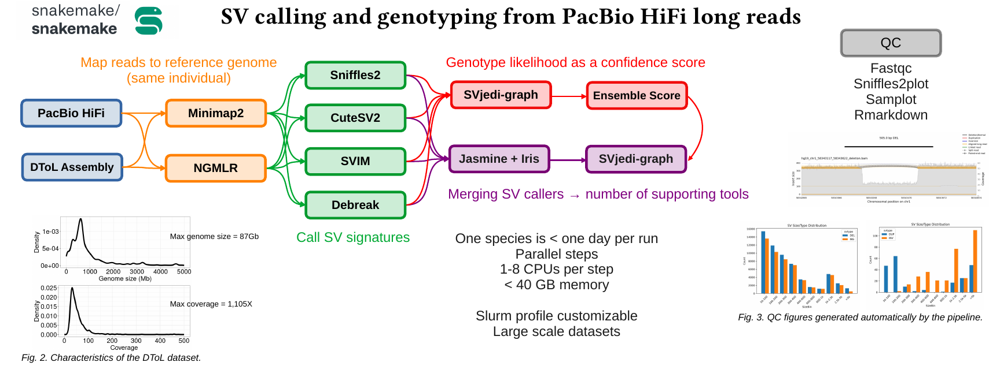
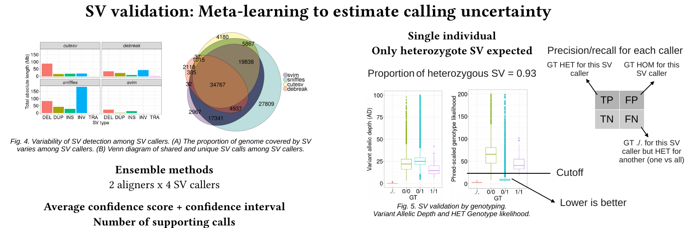

# Snakemake pipeline for the calling and genotyping of genomic Structural Variants based long-read sequencing

**Authors: Thomas Brazier<sup>1</sup>, Lune Angevin<sup>1</sup>, Claire Lemaitre<sup>2</sup> and Claire Mérot<sup>1</sup>**

*Institutions: (1) UMR 6553 ECOBIO, University of Rennes (2) GenScale Team, IRISA-INRIA lab, University of Rennes*

This pipeline performs ensemble calling of Structural Variants (SV) from PacBio HiFi or Oxford Nanopore (ONT) long-read sequencing of a single individual. SV calling is performed by a combination of two aligners (minimap2 + ngmlr) and four different tools: SVIM, Sniffles2, CuteSV2 and Debreak ([poster](images/Poster_PopGroup58_BRAZIER.pdf)). The eight independent callsets are then merged with JasmineSV and SVs are genotyped with SVJediGraph.



The combination of an ensemble of independent callsets and genotype likelihoods allows us to estimate the relative performance of each tool on a given dataset, and to weight these tools in order to get the best calls with a reliable proxy of their uncertainty.




## Installing the pipeline

The following dependencies must be installed before launching the pipeline:
* conda
* snakemake >= 8.9.0
* mamba
* python
* pandas

First you have to clone the github repository where you wish to run analyses.

```
git clone https://github.com/thomasbrazier/evolsv.git
cd evolsv
```

Then, you can install dependencies in a `conda` environment.

```
conda env create -f workflow/envs/snakemake.yaml
conda activate snakemake
```


## New features coming


The current version is fully functional, yet I plan to implement in a near future new features to address more types of data (e.g., ONT) and improve computation times:
* Running one or both aligners (minimap2 or ngmlr, optional), scalability.
* Simplify the rule 'final_report' to generalize better to different options and datasets.
* Better cleanup and compression for temporary and output files (optimize storage).
* Improved documentation and tests.
* CI/CD.


All these changes are being implemented in the `caterpillar` branch.


## Using the pipeline

There are three config files to set up your analysis:
* `config/config.yaml`, where you specify the working directory and all the settings for the different tools.
* `config/samples.tsv`, a three columsn data frame to specify the sample name, the SRA accessions and the reference genome accession. Currently, the pipeline accepts multiple samples but only a single genome accession.
* a profile under `profiles/`, specifying resources for each rule (number of cpus, memory, runtime) and how jobs reach your job scheduler. One is shipped per scheduler:

| Profile | Scheduler | Executor |
| --- | --- | --- |
| `profiles/slurm/` | SLURM | `slurm` |
| `profiles/pbs/` | PBS Pro / OpenPBS (and Torque, with one line swapped) | `cluster-generic` |
| `profiles/sge/` | SGE / SoGE / UGE | `cluster-generic` |
| `profiles/ci/` | none -- dry runs and DAG checks only | -- |

Edit the queue/account settings at the top of the profile you use before the first run. Thread counts live in that profile's `set-threads` block, which lists every rule in the workflow; `.test/test_profiles.py` fails the build if a rule is missing from it or if it names a rule that no longer exists.


After setting up the required config files, you can launch the pipeline in two ways: either by running the `launcher.sh` script (where you can configure your settings if you are using a SLURM job scheduler), or simply by executing the following command in the terminal:

```
snakemake --snakefile ./workflow/Snakefile --configfile ./config/config.yaml --profile ./profiles/slurm --use-conda
```

Do not add `--cores N` to that command. It caps the threads of *every* rule at N even when jobs run on a cluster, so a `--cores 1` silently overrides the whole `set-threads` block. The profile sets `cores:` to a sensible upper bound instead.

Before running the analysis, you can build Conda environments:

```
snakemake --snakefile ./workflow/Snakefile --cores 1 --use-conda --conda-frontend conda --conda-create-envs-only
```

An example dataset with a single sample of the `Vanessa cardui` species can be run with the command:

```
snakemake --snakefile ./workflow/Snakefile --configfile ./config/config_test.yaml --profile ./profiles/slurm --use-conda
```

Alternatively, if you wish to run a custom analysis, with config files in a subdirectory:

```
species=Vanessa_cardui

snakemake -s workflow/Snakefile --configfile data/config/config_$species.yaml \
--use-conda --conda-frontend conda --profile ./profiles/slurm \
--config samples="data/config/samples_$species.tsv"
```


### Running on another job scheduler

The pipeline ships a profile per scheduler. Pick one, edit the site-specific settings at the top of its `config.yaml`, and point `--profile` at it.

**SLURM.** Set `slurm_partition` and `slurm_account` in `profiles/slurm/config.yaml`. The executor plugin is in `workflow/envs/snakemake_v2.yaml`.

**PBS Pro / OpenPBS.** Snakemake has no dedicated PBS executor plugin, so `profiles/pbs/` submits through `cluster-generic`: the `qsub` line in the profile is the only place resources are translated, and a resource not named there is not requested.

```
conda env create -f workflow/envs/snakemake_pbs.yaml
mkdir -p logs/pbs                       # qsub fails if -o/-e do not exist
chmod +x profiles/pbs/pbs-status.py

snakemake --snakefile ./workflow/Snakefile --configfile ./config/config.yaml \
--profile ./profiles/pbs --use-conda
```

Set `pbs_queue` in the profile, and add `-A <project>` to `cluster-generic-submit-cmd` if your site bills projects. On **Torque**, swap the two `-l` lines for the commented alternative in the same file: Torque spells the request `-l nodes=1:ppn=N,mem=Nmb` where PBS Pro uses `-l select=1:ncpus=N:mem=Nmb`.

**SGE / SoGE / UGE.** Same mechanism, via `profiles/sge/`.

```
conda env create -f workflow/envs/snakemake_sge.yaml
mkdir -p logs/sge
chmod +x profiles/sge/sge-submit.sh profiles/sge/sge-status.py

snakemake --snakefile ./workflow/Snakefile --configfile ./config/config.yaml \
--profile ./profiles/sge --use-conda
```

Set `sge_queue`, and set `sge_pe` to a parallel environment that exists on your cluster (`qconf -spl`) -- a missing or wrong PE makes multi-threaded jobs fail at submission on strict clusters. Submission goes through `profiles/sge/sge-submit.sh` rather than a bare `qsub` line for two reasons: SGE enforces `h_vmem` per *slot*, so the wrapper divides the profile's total `mem_mb` by the thread count, and `qsub -terse` is required because `cluster-generic` reads the job id from the first line of stdout.

`profiles/sge/` deliberately does not use `snakemake-executor-plugin-sge`. That plugin is PyPI-only (absent from bioconda and conda-forge), and in 0.6.24 it reads the CPU count from a resource named `threads` rather than from the job's threads -- so every job is submitted single-slot -- and appends `-l tmem=`, a site-specific complex, to every submission.

> **Not yet run against real PBS or SGE hardware.** Both profiles build the DAG correctly and are derived from the executor plugin's own source, but no job has been submitted to a live PBS or SGE cluster. Run the `config_test.yaml` dataset end to end before trusting them for a real analysis, and expect the status scripts (`pbs-status.py`, `sge-status.py`) to be the parts most likely to need tuning against your site's job-retention settings.

### Sequencing technology

The pipeline supports PacBio HiFi and Oxford Nanopore reads. A single key in `config/config.yaml` selects which:

```yaml
sequencing_technology: hifi # hifi (PacBio HiFi/CCS) | ont (Oxford Nanopore)
```

Any other value is rejected before the run starts. The key fills in the technology-dependent parameters of every tool that has them (`TECH_PRESETS` in `workflow/rules/common.smk`):

| Parameter | `hifi` | `ont` |
| --- | --- | --- |
| `minimap_ax` (minimap2 `-x`) | `map-hifi` | `map-ont` |
| `ngmlr_preset` (NGMLR `--presets`) | `pacbio` | `ont` |
| `read_group_platform` (`@RG PL`) | `PACBIO` | `ONT` |
| `max_cluster_bias_INS` (cuteSV) | 1000 | 100 |
| `diff_ratio_merging_INS` (cuteSV) | 0.9 | 0.3 |
| `max_cluster_bias_DEL` (cuteSV) | 1000 | 100 |
| `diff_ratio_merging_DEL` (cuteSV) | 0.5 | 0.3 |

The cuteSV values are the ones [recommended by its authors](https://github.com/tjiangHIT/cuteSV#recommendation-parameters) for each technology.

These are defaults, not overrides: setting any of those keys explicitly in your config file wins over the preset. They are shipped commented out in `config/config.yaml` so the preset applies by default. For instance, to run ONT with a non-default minimap2 preset:

```yaml
sequencing_technology: ont
minimap_ax: lr:hq # overrides the map-ont from the preset; everything else stays ONT
```

Two things worth knowing:

* **Read filtering is not technology-dependent.** `chopper_quality: 10` is used for both, and suits HiFi as well as modern ONT chemistries (R10.4+). On R9-era ONT data a threshold of 10 discards a large fraction of the reads; consider `chopper_quality: 7`. Read length thresholds (`chopper_minlength`, `chopper_maxlength`) are likewise unchanged by the technology.
* **Only the aligners and cuteSV have technology presets.** Sniffles2, SVIM, DeBreak and SVJedi-graph publish none upstream — Sniffles2 derives its thresholds from coverage, DeBreak accepts HiFi/CLR/ONT/mixed BAMs without a flag, and SVJedi-graph maps onto its variation graph with minigraph, which has no per-technology presets. An ONT run therefore uses the same settings as a HiFi run in those four tools. `min_sv_size`, `mapq` and `min_mapq` may deserve a second look on noisier data.


### Starting from pre-aligned BAM files

If your reads are already aligned — for instance because you mapped them to call SNPs — you can skip the SRA download, the read QC and both alignments, which are by far the most expensive stages of the workflow. Set in `config/config.yaml`:

```yaml
start_from_bam: true
reference_fasta: "/path/to/the/reference/used/for/the/alignment.fna" # optional
```

and declare the input files in three extra columns of the sample sheet (see `config/samples_bam.tsv` for a template). The `sra` column is not used in this mode and can be left empty:

```
sample_name	sra	genome	bam_minimap2	bam_ngmlr	fastq
SAMEA8724893		GCA_947247005.1	/path/mm2.bam	/path/ngmlr.bam	/path/reads.fastq.gz
```

**One BAM per aligner is required.** The ensemble method relies on eight independent callsets produced by four callers on two different alignments, and the merging step (JasmineSV/IRIS) is given both BAM files. Supplying the same alignment twice would make the same evidence count as two independent observations and would inflate both the consensus and the per-tool performance scores.

**The reads are still required.** Genotyping with SVJedi-graph maps reads onto a variation graph, so it cannot work from a linear BAM. Give the read file(s) in the `fastq` column; several rows are concatenated, as in the SRA mode.

Requirements on the BAM files, all checked before the run proceeds (see `workflow/scripts/check_bam_reference.py`, which writes a report to `{wdir}/bam/{genome}_{aligner}_bam_check.txt`):

* coordinate-sorted, with a `.bai` index next to the BAM (a `.csi` index is not accepted);
* an `@RG` line whose `SM` tag equals `sample_name` in the sample sheet, because Samplot selects reads by sample id;
* contig names *and* lengths matching the reference. This is the check most likely to fire: the pipeline downloads the GenBank assembly from NCBI, so a BAM aligned against a RefSeq or UCSC copy of the same assembly will be rejected. Point `reference_fasta` at the exact FASTA you aligned to. Assembly metadata is still downloaded from NCBI in that case, since the final report and the sex-chromosome detection need it.

Caveats to be aware of when interpreting the results:

* **The `chopper` read filters are not applied.** In the SRA mode, `chopper_quality`, `chopper_minlength`, `chopper_maxlength`, `chopper_headcrop` and `chopper_tailcrop` decide which reads reach every caller and genotyper. In BAM mode the alignment is used as supplied and the reads passed to SVJedi-graph are unfiltered, so those config keys have no effect. Filter your reads before aligning if you need the equivalent behaviour.
* **Read-level QC (FastQC, NanoPlot) is skipped.** Alignment QC is still produced in `mapping_QC/` and `callability/`, and the final report is unaffected.
* **`sequencing_technology` still matters.** The aligner presets and the `@RG PL` tag are unused in this mode, since the alignments are supplied, but the key still drives the cuteSV clustering parameters. Set it to the technology the BAM files were produced from.
* **Both BAM files are assumed to come from the same read set.** This is not enforced: minimap2 (run with `--sam-hit-only`) and ngmlr legitimately retain different numbers of records, so comparing read counts would raise false alarms. Aligning two different read sets would bias the relative performance scores of the tools.

The BAM files are symlinked, not copied, so no extra storage is used.


## Data directory setup

Project data can be stored in the current `evolsv` git directory. The place where is the `data/` directory must be specified in the parameter `workingdir` in the `config.yaml`. The default is `workingdir: data/` which assumes `data/` to be in te current `evolsv/` directory (see below). `data/` will not be tracked by `git`.

```
.
├── evolsv/
│   ├── config/
│   │   ├── config.yaml
├   |   |── samples.tsv
│   ├── data/
├   ├── profiles/
├   ├   ├── slurm/
│   ├   │   ├── config.yaml
├   ├   ├── pbs/
│   ├   │   ├── config.yaml
│   ├   │   ├── pbs-status.py
├   ├   ├── sge/
│   ├   │   ├── config.yaml
│   ├   │   ├── sge-submit.sh
│   ├   │   ├── sge-status.py
├   ├   ├── ci/
│   ├   │   ├── config.yaml
│   ├── workflow/
```


## Output files

The main output file is a VCF file containing the list of SVs, named `{wdir}/{genome}_final.vcf.gz`. It is the result of merging the eigth SV catalogues generated. Additionnally, a `{wdir}/{genome}_final.tsv` and a `{wdir}/{genome}_final_light.vcf.gz` files are produced. They contain the same set of SV calls, but they are designed to be processed more easily than the full vcf. `{wdir}/{genome}_final.tsv` is a data frame without sequences for an easy import in R for data analysis. `{wdir}/{genome}_final_light.vcf.gz` is a lighter vcf without DNA sequences in REF/ALT and INFO fields (DNA sequences can be very large with structural variation).


We also produce an automatic report to assess the quality and empirical performance of the workflow for the given dataset. Please check `{wdir}/{genome}_finalQC.html` for details. 


## References

Chen, Yu, Amy Y. Wang, Courtney A. Barkley, Yixin Zhang, Xinyang Zhao, Min Gao, Mick D. Edmonds, et Zechen Chong. « Deciphering the Exact Breakpoints of Structural Variations Using Long Sequencing Reads with DeBreak ». Nature Communications 14, nᵒ 1 (17 janvier 2023): 283. https://doi.org/10.1038/s41467-023-35996-1.

Danecek, Petr, et al. « Twelve Years of SAMtools and BCFtools ». GigaScience, vol. 10, nᵒ 2, janvier 2021, p. giab008. DOI.org (Crossref), https://doi.org/10.1093/gigascience/giab008.

Heller, David, et Martin Vingron. « SVIM: Structural Variant Identification Using Mapped Long Reads ». Bioinformatics, vol. 35, nᵒ 17, septembre 2019, p. 2907‑15. DOI.org (Crossref), https://doi.org/10.1093/bioinformatics/btz041.

Jiang, Tao, et al. « Long-Read-Based Human Genomic Structural Variation Detection with cuteSV ». Genome Biology, vol. 21, nᵒ 1, décembre 2020, p. 189. DOI.org (Crossref), https://doi.org/10.1186/s13059-020-02107-y.

Kirsche, Melanie, et al. « Jasmine and Iris: Population-Scale Structural Variant Comparison and Analysis ». Nature Methods, vol. 20, nᵒ 3, mars 2023, p. 408‑17. DOI.org (Crossref), https://doi.org/10.1038/s41592-022-01753-3.

Li, Heng. « Minimap2: Pairwise Alignment for Nucleotide Sequences ». Bioinformatics, édité par Inanc Birol, vol. 34, nᵒ 18, septembre 2018, p. 3094‑100. DOI.org (Crossref), https://doi.org/10.1093/bioinformatics/bty191.

Romain, Sandra, et Claire Lemaitre. « SVJedi-Graph: Improving the Genotyping of Close and Overlapping Structural Variants with Long Reads Using a Variation Graph ». Bioinformatics 39, nᵒ Supplement_1 (30 juin 2023): i270‑78. https://doi.org/10.1093/bioinformatics/btad237.

Sedlazeck, Fritz J., et al. « Accurate Detection of Complex Structural Variations Using Single-Molecule Sequencing ». Nature Methods, vol. 15, nᵒ 6, juin 2018, p. 461‑68. DOI.org (Crossref), https://doi.org/10.1038/s41592-018-0001-7.


